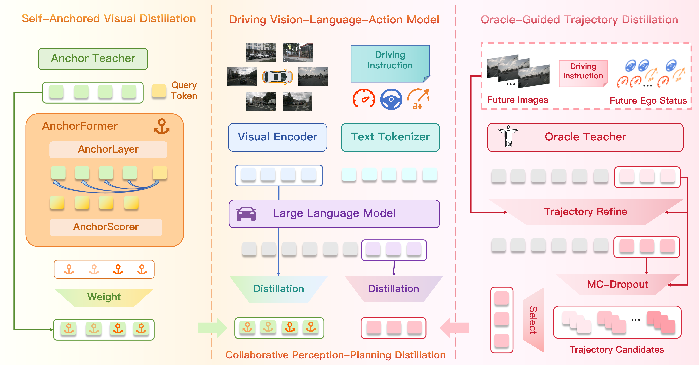
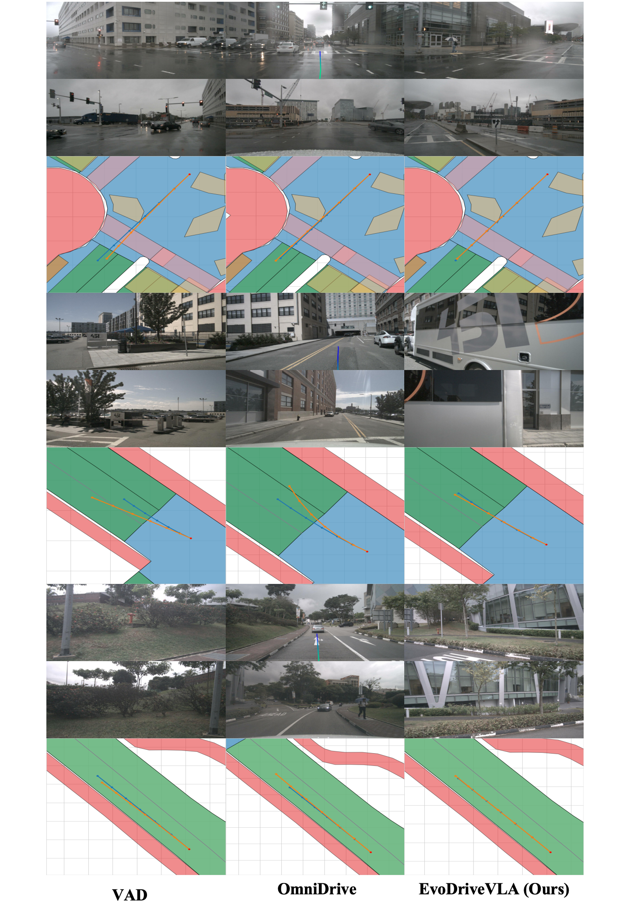

<div align="center">
<a id="readme-top"></a>
<h1>  EvoDriveVLA: Evolving Autonomous Driving VLA Models via Collaborative Perception-Planning Distillation </h1>
<!-- <h3 align="center"><strong>🎉🎉NeurIPS 2025 spotlight🎉🎉</strong></h3> -->

<!-- <a href="https://arxiv.org/abs/2505.17685"></a>
<a href='https://miv-xjtu.github.io/FSDrive.github.io'></a> -->

Jiajun Cao<sup>1,2†</sup>,
Xiaoan Zhang<sup>1,2†</sup>,
Xiaobao Wei<sup>1†</sup>,
Liyuqiu Huang<sup>1,2</sup>,
Wang Zijian<sup>2</sup>,
Hanzhen Zhang<sup>2</sup>,
Zhengyu Jia<sup>2</sup>,
Wei Mao<sup>2</sup>,
Xianming Liu<sup>2</sup>,
Shuchang Zhou<sup>2</sup>,
Yang Wang<sup>2*</sup>,
Shanghang Zhang<sup>1*</sup>,

<sup>1</sup>Peking University,
<sup>2</sup>XPENG

† Equal contribution 

\* Corresponding authors

<div align="center">

</div>


**Vision-Language-Action models have shown great promise for autonomous driving, yet they suffer from degraded perception after unfreezing the visual encoder and struggle with accumulated instability in long-term planning. To address these challenges, we propose EvoDriveVLA a novel collaborative perception-planning distillation framework that integrates self-anchored perceptual constraints and oracle-guided trajectory optimization. Specifically, self-anchored visual distillation leverages self-anchor teacher to deliver visual anchoring constraints, regularizing student representations via trajectory-guided key-region awareness. In parallel, oracle-guided trajectory distillation employs a future-aware oracle-teacher with coarse-to-fine trajectory refinement and Monte Carlo dropout sampling to produce high-quality trajectory candidates, thereby selecting the optimal trajectory to guide the student’s prediction.**


<!-- https://github.com/user-attachments/assets/a99a14a3-a892-4cbe-ac1f-66b777d9081b -->

</div>

## Table of Contents
- [🛠️ Installation](#-Installation)
- [📦 Data Preparation](#-Data-Preparation)
- [🚀 Training](#-Training)
- [🎯 Infer](#-Infer)
- [📈 Evaluation](#-Evaluation)
<!-- - [📜 Citing](#-Citing)
- [🙏 Acknowledgement](#-Acknowledgement) -->
<p align="right"><a href="#readme-top"></a></p>

## 🛠️ Installation

Create the required environment through the following steps:

```bash
git clone https://github.com/hey-cjj/EvoDriveVLA

cd EvoDriveVLA

conda env create -f environment.yml -y

conda activate EvoDriveVLA
```
Download the [Student model](https://huggingface.co/Paipai-zxa/EvoDriveVLA/tree/main/student_model) and [Teacher model](https://huggingface.co/Paipai-zxa/EvoDriveVLA/tree/main/teacher_model).

<p align="right"><a href="#readme-top"></a></p>

## 📦 Data Preparation

1、Download nuScenes

Download the complete dataset from [nuScenes](https://www.nuscenes.org/nuscenes#download) and extract it to `./data/nuscenes`

Or establish a soft connection with your data：

```bash
ln -s /path/to/your/nuscenes ./data
```

Download the [dataset information](https://huggingface.co/Paipai-zxa/EvoDriveVLA/blob/main/cached_nuscenes_info.pkl), [dataset split](https://huggingface.co/Paipai-zxa/EvoDriveVLA/blob/main/full_split.json) and [dataset metrics](https://huggingface.co/Paipai-zxa/EvoDriveVLA/tree/main/metrics).


2、Construct data

Construct training and evaluation base-data that conform to the EvoDriveVLA format respectively:

```bash
python data/gen_data.py --split train

python data/gen_data.py --split val
```

Construct training and evaluation teacher-data that conform to the EvoDriveVLA format respectively:

```bash
python data/gen_data.py --split train --future

python data/gen_data.py --split val --future
```

Construct training and evaluation knowledge distillation data that conform to the EvoDriveVLA format respectively:

```bash
python data/gen_data.py --split train --llm_kd

python data/gen_data.py --split val --llm_kd
```

Data directory format is as follows
```
--data
  --nuscenes_complete_data
  --cached_nuscenes_info.pkl
  --full_split.json
  --metrics
    --gt_traj.pkl
    --gt_traj_mask.pkl
    --stp3_gt_seg.pkl
    --uniad_gt_seg.pkl
  --Drive_KD_train_his_ego_future.json
  --Drive_KD_val_his_ego_future.json
  --Drive_KD_train_his_ego.json
  --Drive_KD_val_his_ego.json
  --Drive_KD_train_his_ego_llm_kd.json
  --Drive_KD_val_his_ego_llm_kd.json
```
<p align="right"><a href="#readme-top"></a></p>


## 🚀 Training
Enter the working directory of EvoDriveVLA:
```bash
cd EvoDriveVLA
```

1、Train Teacher Model

First, train the model using a dataset containing future information to serve as the teacher model.:
```bash
# Set TRAIN_TEACHER=True in run.sh

bash ./qwenvl/train/run.sh
```

2、Train Student Model
Use the trained model containing future information as a teacher model to train the student model.

```bash
# Set TRAIN_TEACHER=False
# Set teacher_model=Your teacher model
# Set ENCODER_KD=False
# Set LLM_KD=False
# Set LOGITS=False
# Set HS=False in run.sh

bash ./qwenvl/train/run.sh
```
<p align="right"><a href="#readme-top"></a></p>

## 🎯 Infer
Run the following command in the EvoDriveVLA directory to infer test dataset:
```bash
python -m inference_scripts.infer_multi \
    --model_name_or_path ${OUTPUT_DIR} \
    --img_dir $img_dir \
    --dataset_use $test_data \
    --eval_save_path ${OUTPUT_DIR}/result.json \
    --max_pixels ${DEFAULT_MAX_IMAGE_SIZE} \
    --min_pixels ${DEFAULT_MIN_IMAGE_SIZE} \
    --model_max_length ${DEFAULT_MAX_TOKEN} \
    --inference True \
    --random False \
```
<p align="right"><a href="#readme-top"></a></p>

## 📈 Evaluation
First, under the EvoDriveVLA directory, match the predicted results with the tokens to facilitate the evaluation:
```
python ./eval_planning/evaluation/evaluation.py \
    --result_file ${OUTPUT_DIR}/result.json \
    --save_file ${OUTPUT_DIR}/eval_result.json \
```
<p align="right"><a href="#readme-top"></a></p>

## 👀 Visualization
Here are the visualization results of our vehicle trajectories.
<div align="center">

</div>

<p align="right"><a href="#readme-top"></a></p>


## 📜 Citing

If you find EvoDriveVLA is useful in your research or applications, please consider giving us a star 🌟 and citing it by the following BibTeX entry:

<!-- ```
@article{zeng2025futuresightdrive,
  title={FutureSightDrive: Thinking Visually with Spatio-Temporal CoT for Autonomous Driving},
  author={Zeng, Shuang and Chang, Xinyuan and Xie, Mengwei and Liu, Xinran and Bai, Yifan and Pan, Zheng and Xu, Mu and Wei, Xing},
  journal={arXiv preprint arXiv:2505.17685},
  year={2025}
}
``` -->
<p align="right"><a href="#readme-top"></a></p>

## 🙏 Acknowledgement
Our work is primarily based on the following codebases:[Impromptu-VLA](https://github.com/ahydchh/Impromptu-VLA.git), [FSDrive](https://github.com/MIV-XJTU/FSDrive) and, [OmniDrive](https://github.com/NVlabs/OmniDrive.git).

<p align="right"><a href="#readme-top"></a></p>